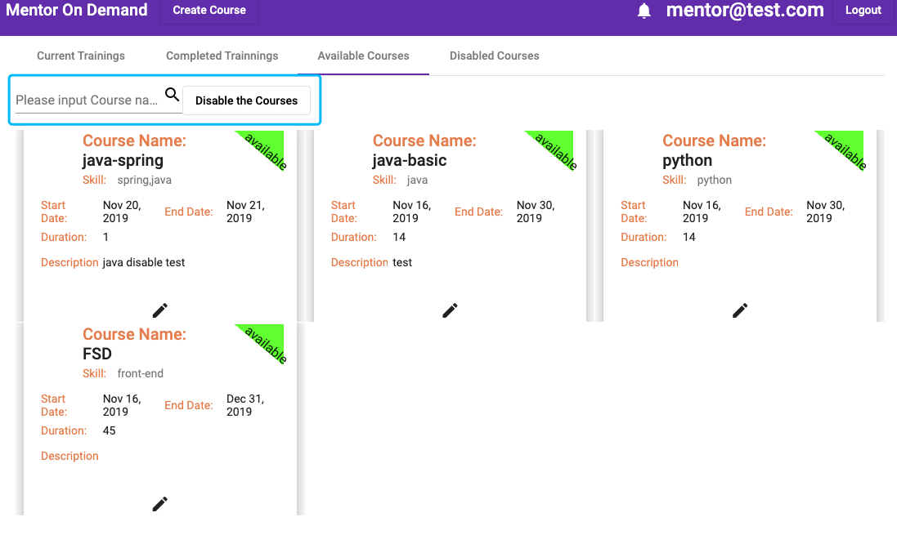
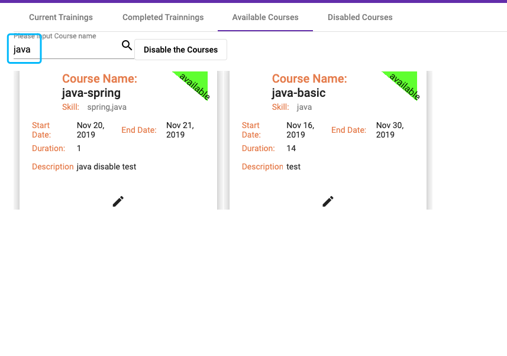
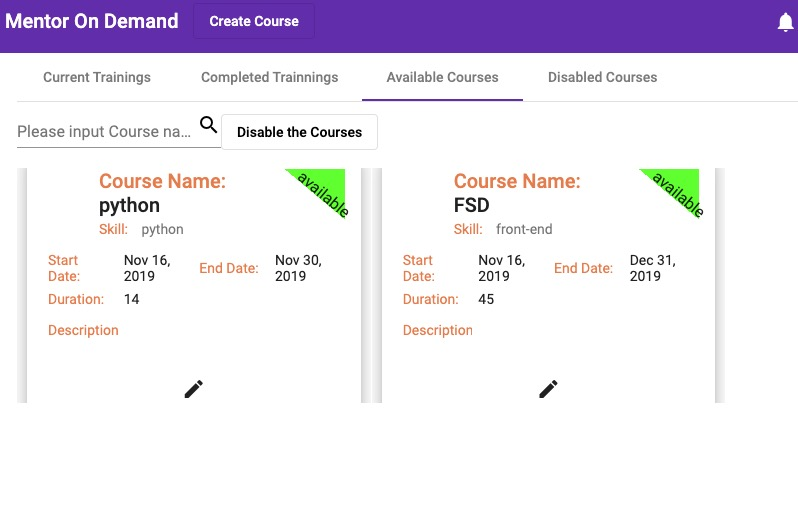
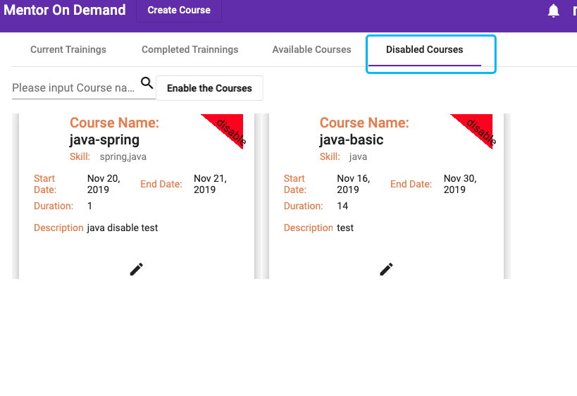
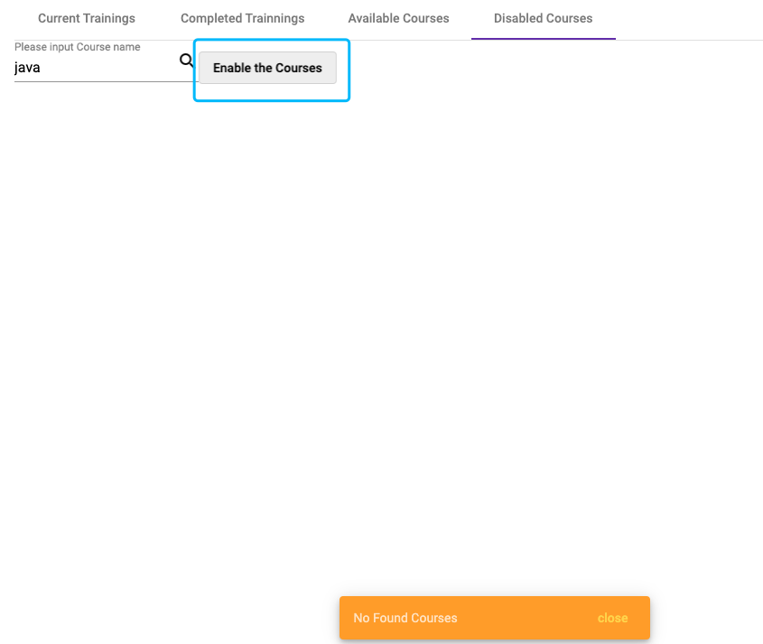
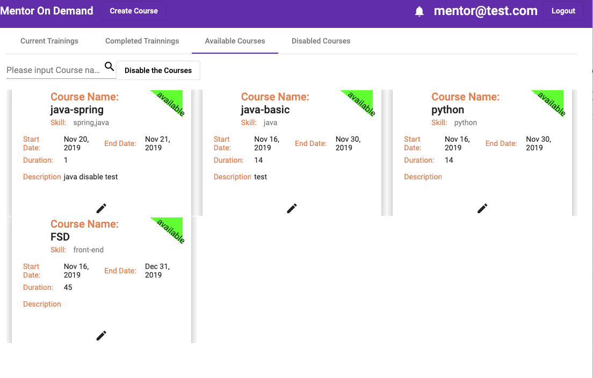
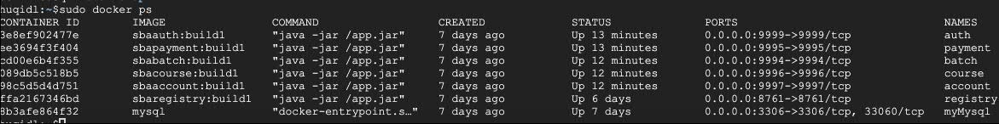

# Front

This project was generated with [Angular CLI](https://github.com/angular/angular-cli) version 8.0.4.

#### Development server

Run `ng serve` for a dev server. Navigate to `http://localhost:4200/`. The app will automatically reload if you change any of the source files.

#### Code scaffolding

Run `ng generate component component-name` to generate a new component. You can also use `ng generate directive|pipe|service|class|guard|interface|enum|module`.

#### Build

Run `ng build` to build the project. The build artifacts will be stored in the `dist/` directory. Use the `--prod` flag for a production build.

##  SBA Evaluation - add a feature to diable course whose name matches with a given String.

#### 1. Solution: Added an input to search course and a button to disable the courses,

#### 2. Login as mentor search the course by name `java` , all the courses having `java` name are shown as below

#### 3.click the `Disable the Course` button ,all the `java` courses are disabled and will not be shown 

#### 4. I also add a `Disabled Course` tab to manage the disabled courses, all the disabled courses will be shown in this tab
 
#### 5. click the `enable the courses` button ,all the disabled coursed will be availabled 
 
 

## Docker Usage

